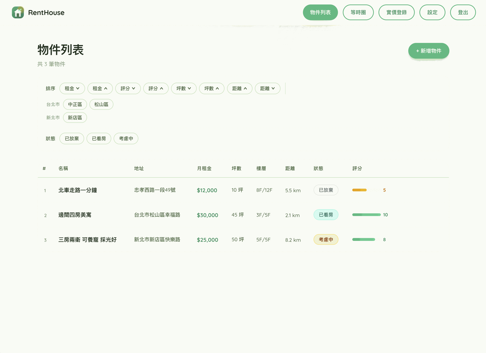
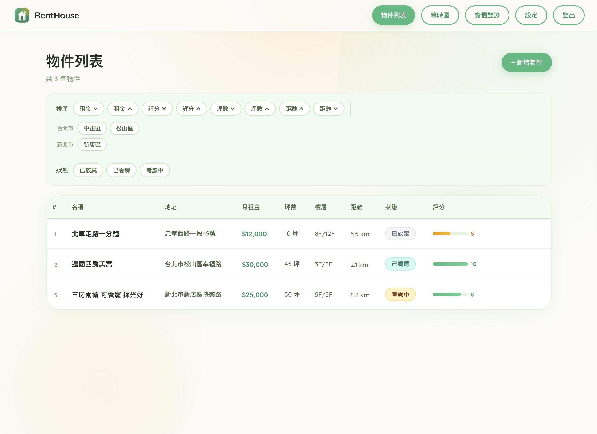
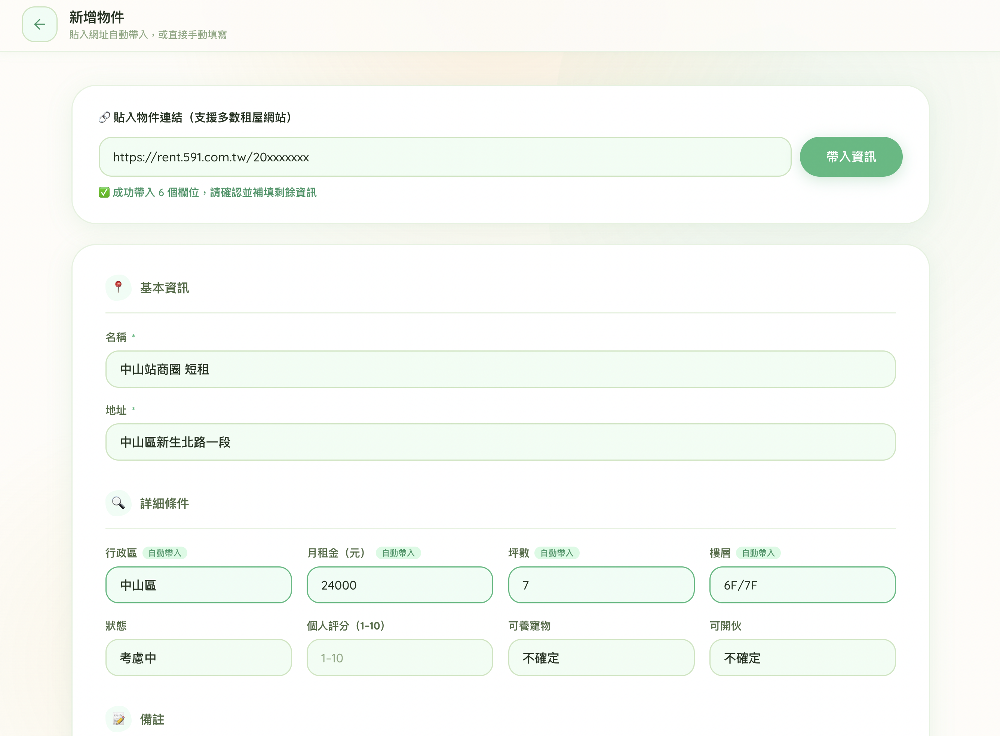
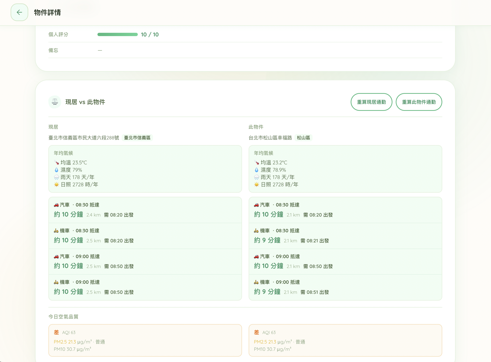
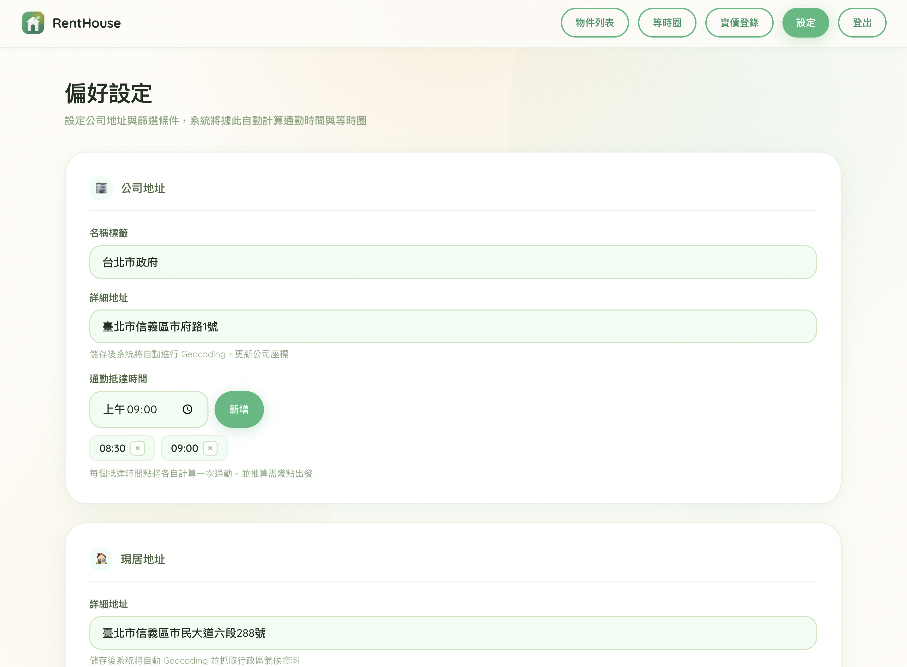
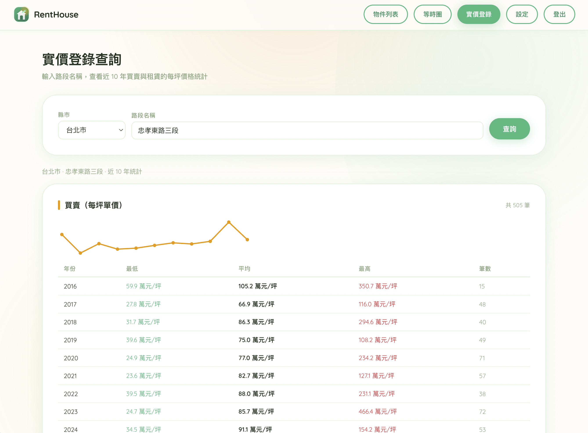

# 🏠 Renthouse Tracker

個人租屋物件評估與管理工具，整合通勤時間計算、等時圈分析、實價登錄查詢與氣候資料，幫助你客觀篩選並紀錄租屋物件。



> ⚠️ **Disclaimer**：本專案為個人自用工具，爬蟲功能請自行評估使用風險，作者不負任何責任（use at your own risk）。

[](https://ko-fi.com/no30131)

---

## ✨ 功能特色

- **物件管理**：手動建檔或貼入租屋網址自動解析，支援評分、備忘、狀態追蹤
- **通勤時間計算**：以 Google Routes API 計算汽/機車通勤時間，依目標抵達時間推算出發時刻
- **等時圈地圖**：以公司地址為中心，Mapbox Isochrone API 生成 30 分鐘車程範圍，地圖上標記所有物件
- **現居 vs 新物件比較**：左右並列顯示氣候與通勤，快速評估搬遷效益
- **氣候資料**：Open-Meteo 取得行政區年均濕度與降雨天數，快取於 DB 避免重複請求
- **實價登錄查詢**：下載政府 CSV，查詢路段近 10 年買賣/租賃每坪單價走勢
- **自動爬蟲**：APScheduler 定期執行排程抓取，套用等時圈過濾與去重後自動存入 DB；亦支援透過 Webhook 接收外部推送

---

## 📸 截圖

**物件列表** — 物件資訊、排序、篩選


**新增物件** — 貼入租屋網址自動帶入資訊


**通勤等時圈** — 以公司為中心顯示 20/30/40 分鐘車程範圍


**現居 vs 此物件比較** — 並列顯示氣候與通勤差異


**偏好設定** — 設定公司地址與目標通勤時間


**實價登錄查詢** — 路段近 10 年買賣/租賃走勢


---

## 🛠 技術堆疊

| 層 | 技術 |
|----|------|
| 後端 | Python 3.13 + FastAPI + SQLAlchemy + GeoAlchemy2 |
| 資料庫 | PostgreSQL 17 + PostGIS 3.5 |
| DB 遷移 | Alembic |
| 前端 | React 19 + Vite + TypeScript |
| 地圖 | Leaflet + OpenStreetMap |
| 套件管理 | uv（後端）/ yarn（前端）|
| 設計風格 | Solar Punk |

---

## 📋 前置需求

需申請以下服務的 API Key：

| 服務 | 用途 | 費用 |
|------|------|------|
| [Google Maps Platform](https://developers.google.com/maps) | Geocoding + Routes API | 每月有免費額度 |
| [Mapbox](https://www.mapbox.com/) | Isochrone API | 每月有免費額度 |

氣候資料使用 [Open-Meteo](https://open-meteo.com/)，**無需 API Key**。

---

## 🚀 快速啟動

### 方式一：Docker Compose（推薦）

```bash
# 1. 複製專案
git clone https://github.com/no30131/renthouse-tracker.git
cd renthouse-tracker

# 2. 設定後端環境變數
cp backend/.env.example backend/.env
# 編輯 backend/.env，填入 API Key 與密碼

# 3. 啟動 DB + 後端
docker compose up -d

# 4. 啟動前端（另開終端機）
cd frontend
cp .env.example .env      # 預設指向 http://localhost:8000
yarn install
yarn dev
```

前端開啟 [http://localhost:5173](http://localhost:5173)，後端 API 文件在 [http://localhost:8000/docs](http://localhost:8000/docs)。

---

### 方式二：本機開發

**後端**

```bash
cd backend

# 安裝 uv（若尚未安裝）
curl -LsSf https://astral.sh/uv/install.sh | sh

# 安裝依賴
uv sync

# 設定環境變數
cp .env.example .env
# 編輯 .env，填入各項設定

# 啟動 PostgreSQL + PostGIS（需自行安裝，或用 Docker）
docker compose up -d db

# 執行 DB migration
uv run alembic upgrade head

# 啟動後端
uv run uvicorn app.main:app --reload --port 8000
```

**前端**

```bash
cd frontend
cp .env.example .env
yarn install
yarn dev
```

---

## ⚙️ 環境變數說明

複製 `backend/.env.example` → `backend/.env`，依下表填寫：

| 變數 | 說明 | 必填 |
|------|------|------|
| `DATABASE_URL` | PostgreSQL 連線字串 | ✅ |
| `ADMIN_USERNAME` | 管理員帳號 | ✅ |
| `ADMIN_PASSWORD_HASH` | bcrypt 雜湊密碼（見下方產生方式） | ✅ |
| `JWT_SECRET_KEY` | JWT 簽名金鑰（隨機長字串即可） | ✅ |
| `GOOGLE_API_KEY` | Google Geocoding + Routes API Key | ✅ |
| `MAPBOX_TOKEN` | Mapbox Public Token | ✅ |
| `WEBHOOK_SECRET` | Webhook 驗證密鑰 | ✅ |
| `CORS_ORIGINS` | 允許的前端來源（預設 `http://localhost:5173`）| ❌ |
| `CRAWLER_ENABLED` | 啟用排程爬蟲（預設 `false`）| ❌ |

**產生密碼雜湊**：

```bash
cd backend
uv run python -c "import bcrypt; print(bcrypt.hashpw(b'your_password', bcrypt.gensalt()).decode())"
```

---

## 🕷 爬蟲排程

排程抓取**預設關閉**。搜尋條件在 `backend/app/crawler_config.py` 修改，啟用方式：在 `backend/.env` 設定 `CRAWLER_ENABLED=true`。

資料來源介面定義於 `backend/app/services/listing_provider.py`，請依目標平台自行實作 `fetch_listings()`；亦可透過 `POST /api/crawler/ingest` 從本地腳本推送資料。

---

## 📁 專案結構

```
renthouse-tracker/
├── backend/              # FastAPI 後端
│   ├── app/
│   │   ├── routers/      # API 端點
│   │   ├── services/     # 業務邏輯（通勤、爬蟲、氣候…）
│   │   ├── models/       # SQLAlchemy 資料模型
│   │   ├── schemas/      # Pydantic 資料結構
│   │   ├── config.py     # 環境變數設定
│   │   └── crawler_config.py  # 爬蟲搜尋條件
│   ├── alembic/          # DB migration
│   ├── Dockerfile
│   └── pyproject.toml
├── frontend/             # React + Vite 前端
│   └── src/
├── docker-compose.yml
└── project_spec.md       # 詳細系統規格與開發藍圖
```

---

## 📄 License

MIT
